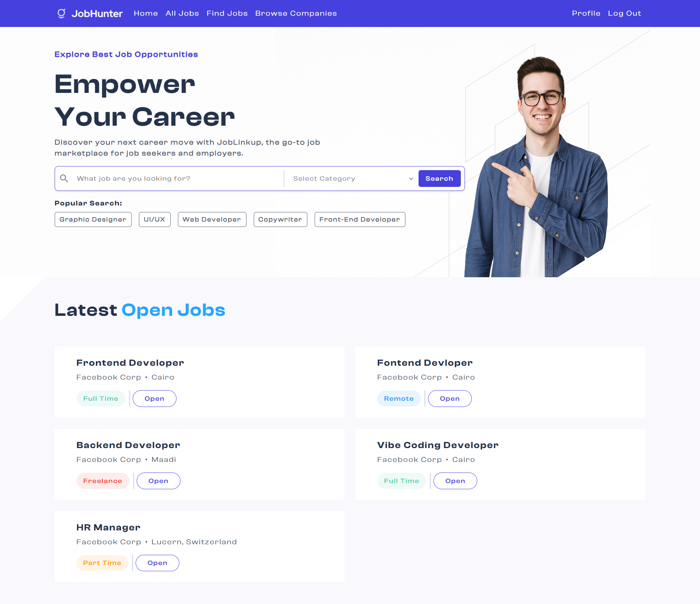
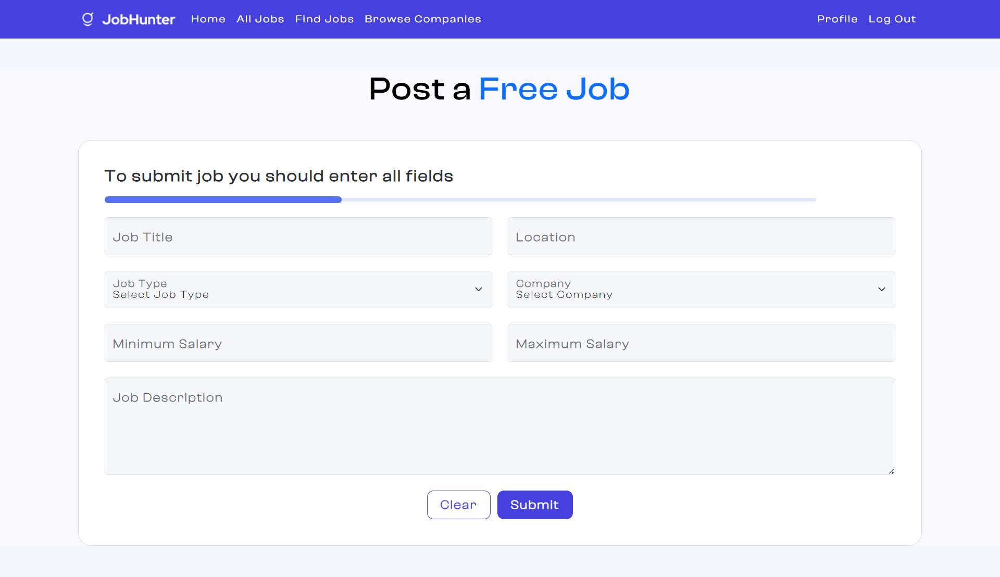

# 🧑‍💼 Job Hunter | Job Board Platform - Frontend (React)

This is the **frontend application** of the **Job Board platform**, a full-featured job marketplace where users can register, browse job listings, and apply by uploading their resumes. Employers can also sign up and post new job opportunities.

It was developed as part of the **ITI Projects (2025)** during the **ITI ICC Training**.

> This repository represents the backend service only. It is part of the larger full-stack project [Job Hunter Platform](https://github.com/MohamedAhIsmail/job-hunter-platform).

---

## 📸 Screenshots

  
  

---

## 🚀 Features

- 👤 User authentication (JWT-based)
- 📄 Resume upload and job application
- 🔍 Search and filter job listings
- 🏢 Employer dashboard for posting jobs
- 💼 Role-based UI (Job Seeker vs Employer)
- 🌙 Responsive and modern UI with MUI & Bootstrap
- 🌍 Supports both English & Arabic (planned)

## 🛠️ Tech Stack

| Category       | Technology                |
|----------------|---------------------------|
| **Frontend**   | React 19, Vite            |
| **Styling**    | MUI, Bootstrap            |
| **State Management** | Zustand                   |
| **Forms**      | Formik + Yup              |
| **Routing**    | React Router DOM v7       |
| **Auth**       | JWT                       |
| **API Client** | Axios                     |


---

## 👥 Our Team

| Name          | GitHub Profile                                         |
| ------------- | ------------------------------------------------------ |
| Mohamed Ahmed | [@MohamedAhIsmail](https://github.com/MohamedAhIsmail) |
| Malik Hussein | [@malikhussein](https://github.com/malikhussein)       |
| Ahmed Amr     | [@ahmedamr3000](https://github.com/ahmedamr3000)       |
| Mohamed Eid   | [@Mohamedeid602](https://github.com/Mohamedeid602)     |
| Omar Abdeen   | [@OmarAbdeen](https://github.com/Test0-VC)             |

---

## 🔄 Project Origin

This repository is a clean version extracted from the original team repository that contains the full commit history of the collaboration.

👉 [Original Team Repository](https://github.com/malikhussein/ITI-react-job-board)

---

## 🚀 Installation

```
# 1. Clone the repository
git clone https://github.com/MohamedAhIsmail/job-hunter-platform-react.git

# 2.
cd job-hunter-platform-react

# 3. Install dependencies
npm install

# 4. Run development server
npm run dev
